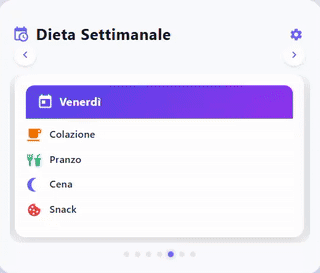

#  Dieta-Card for Dieta-Package

## Reference Guide [HERE](https://github.com/OneStatePackages/dieta-package)

<table width="100%">
  <tr>
    <td align="center" width="50%"><strong>Full View</strong></td>
    <td align="center" width="50%"><strong>Compact View</strong></td>
  </tr>
  <tr>
    <td align="left">
      
    </td>
    <td align="right">
      
    </td>
  </tr>
</table>
